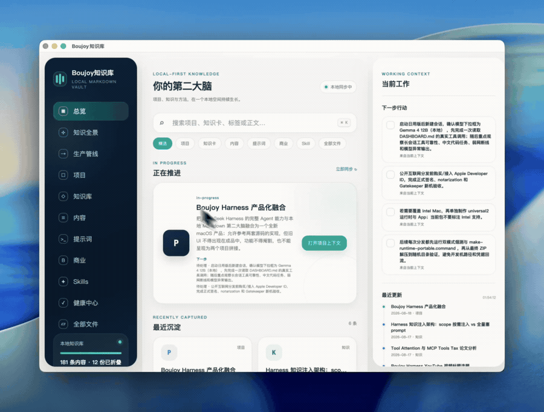

# Boujoy Local Markdown Memory

## 别把记忆交给聊天记录。把它写回你自己拥有的 Markdown。

一个面向 Codex 与 WorkBuddy 的本地优先知识库：用普通文件保存项目、判断、方法和提示词；用轻量索引让 Agent 在真正需要时读到相关上下文。

**不是第二个网盘，不是云端黑盒，更不是“自动塞满上下文”的记忆插件。它是一套你能打开、能迁移、能审计、能长期复用的本地工作记忆。**

[English](README_EN.md) · [观看完整演示](https://github.com/asen-goat-mine/boujoy-local-markdown-memory/releases/download/demo-2026-08-19/Boujoy-Local-Markdown-Memory-Demo.mp4)

  

README 内自动播放知识库 UI 演示；点击即可打开完整 23 秒视频。

## 为什么要做它

聊天记录会变长、工作会变复杂、模型会换、工具会换。但一份写得好的本地 Markdown 项目卡、知识卡或提示词，十年后仍然能被你、Codex、WorkBuddy 和任何文本编辑器读懂。

Boujoy Local Markdown Memory 的目标不是“让 AI 记住一切”，而是建立一条可靠的链路：

~~~text
原始对话 / 临时资料
        │
        ▼
价值筛选 → 去重判断 → 压缩为知识卡 → 写回 Markdown
        │                                  │
        └─────────────── 索引与当前项目上下文 ─┘
                                           │
                                           ▼
                              Agent 按需读取相关内容
~~~

这样，长期上下文不再只存在于某个聊天窗口、某个账户或某次模型调用里。

## 它的核心原则

| 原则 | 具体含义 |
| --- | --- |
| Markdown 是唯一数据源 | 数据库、向量索引、聊天缓存都不能替代你的原始知识文件。 |
| 先索引，后按需读取 | 启动只读 Dashboard 和轻量索引；主题命中后再读取最相关的 1 到 3 张卡，避免整库灌入上下文。 |
| 保存前先压缩 | 把长对话压成结论、场景、决策、方法与下一步，而不是把聊天原文倒进仓库。 |
| 先去重再写入 | 相似主题优先更新原卡；新判断会标出已更新或已废弃，不制造多份相互矛盾的“记忆”。 |
| 本地优先且可审计 | 所有规则、索引、卡片和历史都可以直接打开查看；不需要数据库、云端知识服务或外部 API。 |
| UI 只读 | 预览层帮助浏览、搜索、阅读和检查健康状态，但不会偷偷改写你的 Markdown。 |

> 公开仓库只带规则、索引入口、可删除的合成示例卡和已审核的产品 UI 演示动图；不包含作者的项目、知识、提示词、偏好、日志、私人素材、Skill 或凭据。

## 三分钟开始

### 1. 获取仓库

~~~bash
git clone https://github.com/asen-goat-mine/boujoy-local-markdown-memory.git
cd boujoy-local-markdown-memory
~~~

也可以直接下载 ZIP 并解压。

### 2. 把它作为工作根目录打开

- **Codex**：打开仓库根目录。根目录的 AGENTS.md 会定义启动读取、检索、保存、去重和安全边界。
- **WorkBuddy**：将仓库根目录设为工作区；两者读取同一个 Vault，不维护两份记忆。
- **普通编辑器**：直接用 VS Code、Obsidian、Typora 或 Finder/Explorer 浏览也可以，数据仍是正常 Markdown。

### 3. 打开只读预览

完整模式只需 Python 3.9+ 标准库，不需要安装 pip、npm、数据库或外部 API：

~~~bash
# macOS
./open-preview.command
~~~

Windows 下双击 open-preview.cmd。预览服务默认只监听 127.0.0.1，并优先使用本地端口 8765。

如果电脑没有 Python，仍可以打开 Knowledge-UI/index.html，选择 Vault 文件夹进入浏览器兼容模式；自动刷新、本地媒体 Range 和在文件夹中显示等能力会降级。

macOS 用户还可以运行 Knowledge-UI/install-macos-app.command，在本机生成桌面 App 入口。仓库不提交预编译 App。

## 和 Codex / WorkBuddy 一起用

这套 Vault 不靠关键词触发。它通过 AGENTS.md、启动索引、项目上下文和按需补读规则工作。

你可以直接这样对 Agent 说：

- “把这次决定压缩成项目卡，先检查有没有相似主题。”
- “基于我的知识库，告诉我当前项目最重要的下一步。”
- “把这套方法沉淀成可复用知识卡，保留适用场景和边界。”
- “按我已有的 AI 科普风格，写一版口播，但不要编造历史偏好。”
- “收尾当前阶段，记录真实完成项、阻塞项和下一步。”

一个健康的 Agent 工作流通常是：

1. **开始**：先读取 AGENTS.md、Dashboard 和 00-System/Boot.md；随后轻量读取 Hot-Index、Memory-Index 和 Active-Context。
2. **命中主题**：只补读相关项目卡或知识卡，而不是扫描整库。
3. **做事**：把输出写进正确的项目、知识、内容、提示词或商业目录。
4. **收尾**：更新真实进度和下一步，不伪造测试、交付或保存记录。

## 目录就是你的信息架构

| 路径 | 作用 |
| --- | --- |
| 00-System | 启动、检索、价值筛选、去重、安全、索引与检查点规则。 |
| 01-Inbox | 尚未整理的外部资料和临时捕获入口。 |
| 02-Projects | 项目、产品、系统方案、决策与进度。 |
| 03-Knowledge | 可长期复用的方法、技术知识和判断。 |
| 04-Content | 文章、脚本、选题与交付草稿。 |
| 05-Prompts | 可复用提示词和风格说明。 |
| 06-Business | 商业、运营、客户与变现判断。 |
| 90-Archive | 过期、低频或已废弃内容。 |
| Knowledge-UI | 跨平台、本地、只读的预览界面。 |
| tools | 无依赖的索引检查和健康检查工具。 |

## 怎样写一张真正有用的卡

不要把整段聊天复制进去。每张高价值卡都应该至少回答：

1. **一句话结论**：现在到底知道了什么？
2. **适用场景**：什么情况下可以复用？
3. **关键决策**：为什么这样做，而不是另一种做法？
4. **可复用方法**：下次可以照着执行的步骤是什么？
5. **后续行动**：还缺什么验证、谁来做、下一步是什么？
6. **标签、来源、更新时间**：方便检索和判断时效。

可以从 00-System/Knowledge-Card-Template.md 和各目录的示例卡开始。示例内容是合成的，可以安全删除或替换。

## 预览界面能做什么

Knowledge-UI 是浏览器 / 桌面入口，不是第二套数据系统。它会直接读取当前 Vault，支持：

- 按标题、标签和正文搜索。
- 浏览项目、知识、内容、提示词和全部 Markdown。
- 渲染 Markdown、内部链接、任务、表格、代码和本地媒体。
- 读取当前工作、下一步行动、最近更新与关系图。
- 查看内容生产管线和只读健康中心。
- 自动检测 Markdown 的新增、修改和删除。
- 仅在当前 Vault 范围内定位 Finder / Explorer 文件。

它不会向外上传 Vault，不会建立远程数据库，也不会替你写入知识卡。

## 隐私与公开边界

- “本地优先”描述的是 Vault 和预览服务的数据处理方式，不代表 Codex、WorkBuddy 或 Git 托管平台离线运行。
- 私人知识库请使用私有仓库，或将公开系统模板和私人工作 Vault 分开。
- 不要把密码、API Key、客户隐私、身份证件、银行卡或未经授权的对话原文写入知识卡。
- Git 跟踪到的 Markdown 可能被推送到远端；提交前先检查敏感内容。
- 预览 UI 只绑定本机回环地址；没有遥测和外部资产。

进一步说明见 [PRIVACY.md](PRIVACY.md) 与 [SECURITY.md](SECURITY.md)。

## 它不是什么

Boujoy Local Markdown Memory 不是云同步服务、数据库、向量搜索引擎、Markdown 编辑器，也不是必须常驻的 MCP 服务。

它首先是一套开放的 Markdown 约定。未来可以做可选的只读 MCP 适配层，让更多 Agent 用标准工具读取它；但 MCP 不会取代 Markdown，也不会成为唯一数据源。

## 维护与验证

~~~bash
python3 tools/vault_doctor.py
python3 tools/sync_index_status.py --check
python3 -m unittest discover -s tests
~~~

这些检查会验证索引、路径、安全边界和预览服务契约。公开仓库的 GitHub Actions 也会在 macOS 与 Windows 上执行静态和单元测试。

## 常见问题

### 会把整个知识库发给模型吗？

不应该。默认工作方式是先读轻量索引，再按相关性读取少量卡片。没有依据时，Agent 应明确说明没有知识库依据，而不是编造历史。

### 没有 Python 能用吗？

能。浏览器兼容模式允许你选择 Vault 后直接查看 Markdown，但完整模式的自动刷新和部分本地能力需要 Python 3.9+。

### 可以和 Obsidian 一起用吗？

可以。Obsidian 只是编辑器之一；这套结构使用普通文件和相对链接，不绑定单一应用。

### 可以接 MCP 吗？

可以作为后续的可选只读接口，但当前核心不依赖 MCP。先让 Markdown、规则和索引保持可用，才是最稳定的跨 Agent 方案。

## 许可

本项目使用 [MIT License](LICENSE) 发布。第三方说明见 [THIRD_PARTY_NOTICES.md](THIRD_PARTY_NOTICES.md)。
